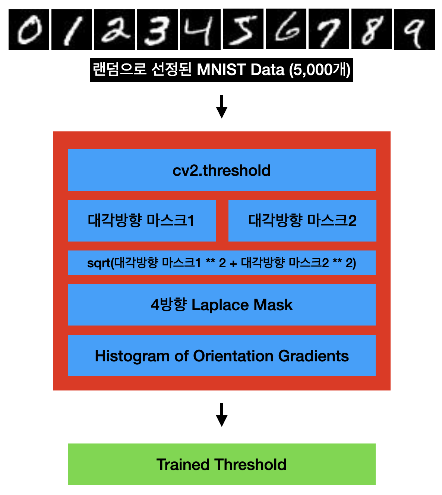
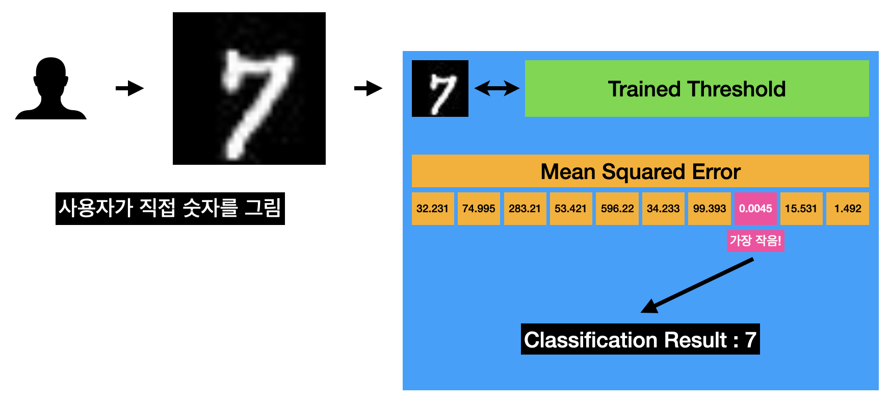

# Classification of MNIST Datasets using OpenCV and Numpy

In this project, I will be classifying the MNIST Datasets using OpenCV for convolution, mean squared error, and HoG (Histogram of Oriented Gradient). This approach is commonly used in handcrafted machine learning due to the feature extraction phase.

# Phases Overview

The project consists of two main phases: the training phase and the testing phase.

## Training Phase

The training phase involves extracting features from the data and is utilized to compare input images with real images during the testing phase. This process is carried out in the `train.py` file, while the feature extraction is performed in `feature_extraction.py`. The trained data is referred to as the "__Train Threshold__," which represents the average values for each label obtained from the feature-extracted images during the training phase.

## Testing Phase

In the testing phase or prediction phase, we apply the same feature extraction process to the input images as in the training phase. We then compare them using mean squared error (MSE). The label with the lowest MSE value indicates the highest probability of the input image being classified as the corresponding label.
